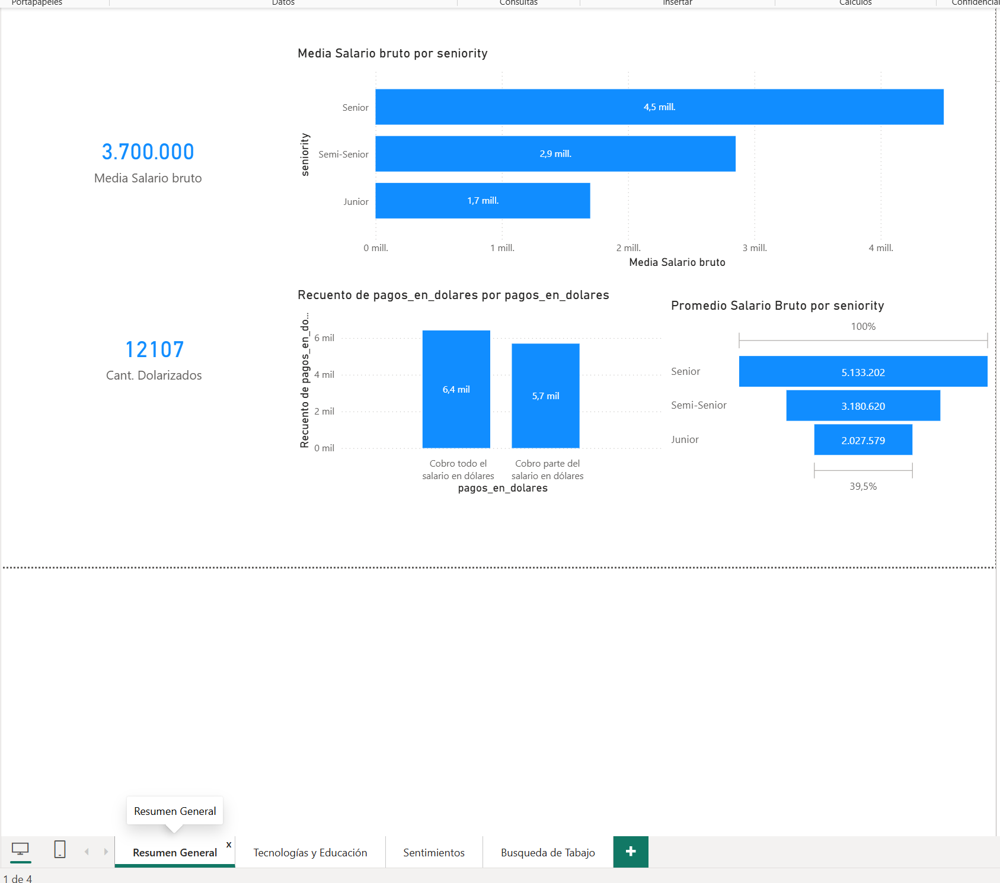
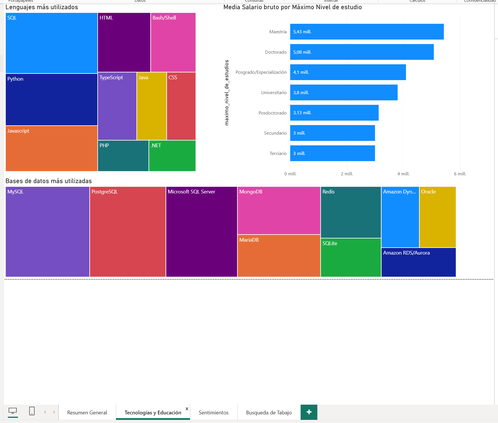
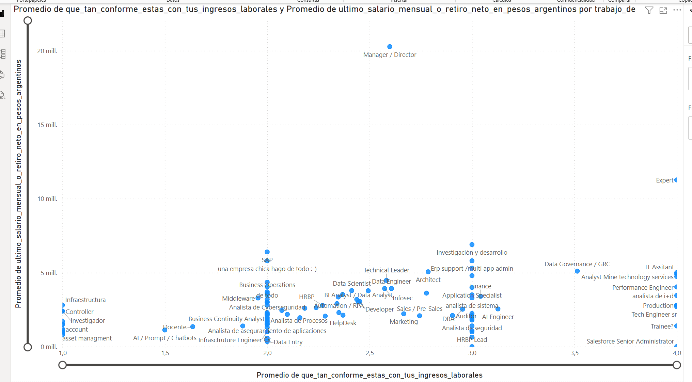
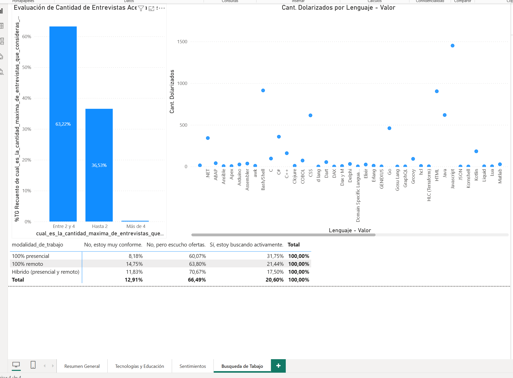

# Data Cleaning and Analytics Documentation 

# Análisis de Salarios IT Argentina Febrero 2026 - Dashboard Power BI
### (Proyecto en desarollo)
Este proyecto consiste en un dashboard interactivo desarrollado en **Power BI** utilizando los datos de la encuesta de sueldos de la comunidad IT en Argentina (basado en el dataset de Sysarmy). El objetivo es demostrar habilidades en la limpieza de datos, modelado, uso de DAX y visualización de insights estratégicos.

## Objetivo del Proyecto
Proveer una herramienta visual para entender las tendencias salariales, el impacto de la experiencia (Seniority), la modalidad de trabajo y el uso de nuevas tecnologías (IA) en el mercado laboral tecnológico actual.

## Stack Tecnológico
* **Power BI Desktop**: Creación de visualizaciones y diseño del dashboard.
* **Power Query**: Limpieza de datos, normalización de textos y técnicas de *Unpivot* para el análisis de stacks tecnológicos.
* **DAX (Data Analysis Expressions)**: Creación de medidas personalizadas (Medianas, % de dolarización, etc.).

## Estructura del Dashboard
El reporte se divide en tres hojas principales:

1.  **Resumen General**: Vista general de salarios (Bruto/Neto), distribución por Seniority y penetración de sueldos dolarizados.
2.  **Tecnología y Educación**: Análisis de los lenguajes más utilizados (procesados mediante técnicas de atomización de datos) y la relación entre el nivel académico y los ingresos.
3.  **Sentimiento**: Un análisis del "lado humano", cruzando la conformidad salarial con el puesto laboral.
4.  **Búsqueda Laboral**: Análisis de la modalidad de trabajo, la tecnología utilizada y los sueldos en relación a la búsqueda activa.

## Hallazgos Principales
* **La brecha del remoto**: Las posiciones 100% remotas presentan un **X%** más de salarios dolarizados que las presenciales.
* **IA en el Workflow**: Los profesionales que utilizan herramientas de IA "Mucho" o "Constantemente" perciben una mediana salarial un **X%** superior.
* **Tolerancia en Entrevistas**: El límite de tolerancia para la mayoría de los candidatos es de **X** entrevistas; a partir de ahí, la intención de abandono del proceso aumenta.

## Desafíos Técnicos Superados
* **Normalización de Lenguajes**: Se utilizó Power Query para dividir columnas por delimitadores y anular la dinamización de filas, permitiendo contar individualmente cada tecnología mencionada en respuestas múltiples.
* **Tratamiento de Outliers**: Se implementaron filtros lógicos para excluir valores salariales no representativos (errores de carga o valores simbólicos) que distorsionaban la mediana.
* **Orden Lógico**: Implementación de columnas de índice personalizadas para ordenar categorías de Seniority y Educación de forma jerárquica y no alfabética.

## Screenshots
### Resumen

### Tecnología y Educación

### Conformidad 

### Relación con Búsqueda Laboral

---
Desarrollado por [MDL-Proyectos]  